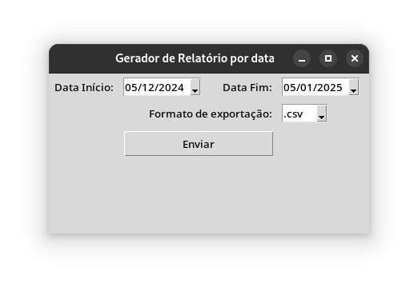

# db2file

---

The idea is to implement a python based database table exporter to different file formats, like csv and json files.

## Goals to achieve:
- [ ] Database connection
- [x] Date interval filtering
- [ ] Export file to FTP or local
- [x] interface to get inputs (easily editable with guiInterfaceTemplate implemented)
- [ ] executable file
- [ ] csv format
- [ ] json format

## Screenshots:
### Main Form Screen
